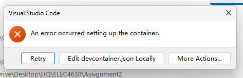
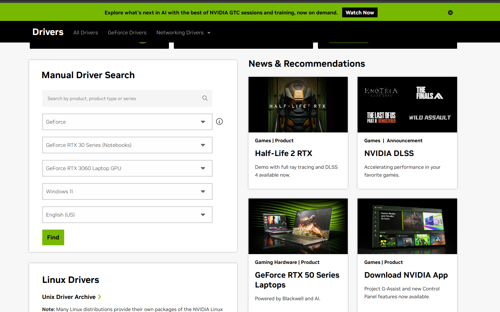
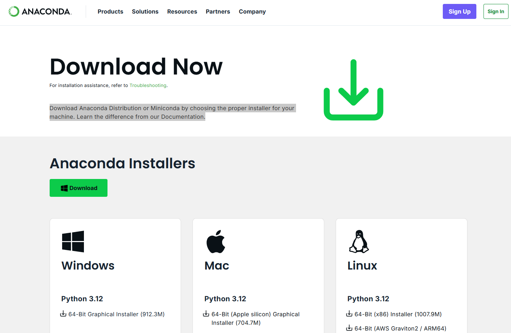

# GPU setup learning

This is Hengji's learning of how to setup the NVIDIA GPU for Deep Learning.

## Why I need to write this blog? The professor has already provided powerful GPU for our learning.

The first reason is that when I tried to connect to the `Dev Container`, it always failed and show me Figure 1, which makes me feel confused.

Figure 1: The Error message I come across when connecting the `Dev Container`.

Thanks for tutors' help, I can successfully connect to professor's GPU now.

The second reason is the GPU I cannot use for a long time, now I enrolled in ELEC4630, I can use the powerful GPU provided by professor, but in the future, I cannot use the professor's GPU for a lifetime. 

Also, in the future the advanced GPU will be produced, so learning to setup the GPU for Deep Learning is necessary, it is not in the lecture slides but this is important for learning Deep Learning, that's what I think.

These learning resources are from Github, the address is here:
 - [Setup-NVIDIA-GPU-for-Deep-Learning](https://github.com/entbappy/Setup-NVIDIA-GPU-for-Deep-Learning/blob/main/README.md)

This is a very good resource easy to read and understand, so it collects 375 stars until now!

Then I will talk my learning process of setup the GPU.

## GPU setup steps.

### 1. NVIDIA Video Driver.

The GPU driver is necessary if we want to use the GPU. The address is here:
 - [NVIDIA GPU Drive Download](https://www.nvidia.com/en-us/drivers/)

After we opened the link, the website should be like Figure 2.

Figure 2: The NVIDIA Driver download website page.

According to our devices, we can select the suitable Driver to download. My GPU is `NVIDIA GeForce RTX 3060 Laptop GPU`, just select the one we have and then choose the system we are using and then download it. Remember to download the latest version of Driver.

### 2. Visual Stdio C++

Visual Stdio is the what we used to write the code, and C++ is also required to be installed. So remember to select the C++ options. I skiped this step because when I setup GPU, the Visual Stdio has already been installed in my laptop. Here is the address for downloading Visual Stdio

 - [Visual Stido Code](https://code.visualstudio.com/)

### 3. Anaconda / Miniconda

Anaconda is to install all deep learning packages, we can download here:

 - [Anaconda / Miniconda](https://www.anaconda.com/download/success)

After we clicked the link, the page should be like the following Figure 3:

Figure 3: The Anaconda / Miniconda download page.

My system is Windows 11, so I selected the windows download package.

### 4. CUDA Toolkit

The next step is to download CUDA, when we are doing this step, it is very important to remember the version we downloaded, this will influence the Pytorch version we need to download. The link is here:

 - [CUDA Toolkit Archive](https://developer.nvidia.com/cuda-toolkit-archive)

This page should be like Figure 4.

