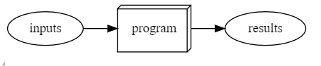
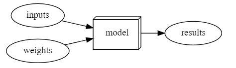
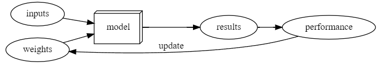
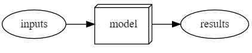

# Hengji's learning blog about Deep Learning & Fastai

The learning after reading the fastbook "01_intro.ipynb", this contains my understand to the 01_intro.ipynb, and I will explain it in my words.

## Maching Learning

### Traditional Programs

Normally, when the coders are planing to write a program to solve some problems, they just need to think about what inputs they need and what acts should the code do, and then write the code. For example when we are writing a function in Python, we need to think about what input the function require and what steps it should do and what varaible it will return. Like the Python below.

```python
def two_number_addition(number1, number2):
    value = number1 + number2
    return value
```
To the code upon, it takes two numbers as input and do the addition operation. We use the following graph to represent this step.



Figure 1: Traditional Program

### Weight

Weights are variables, the notebook take a example of the dog classifier, it takes images pixels as inputs, the weights are values define how the program will operate. The structure is shown in the following figure.



Figure 2: Weights considered

### Weight Update
During the machine learning model process, weight should be able to be adjusted every time according to the results of training. It should be sent to the model together with the input data, then the model will give out the result of the training, the model will compare the results with the real label, then evaluate the performance of the model, if the performance do not good, the weight will be updated and then send to the model with input data again, after several iterations, make the performance of the model be perfect. The process should be like the following figure.



Figure 3: Update weight after the evaluation of performance.

### After the training process

After we finished the training of the model, the model should be able to perform the actions we required it to do. We give the model input, then the model give us output. This process is shown in the following figure.



Figure 4: Apply the model finished training.

We might find that this the Figure 4 is similar to Figure 1, this is because a trained model can be treated just like a regular computer program.


## The training process of the dog & cat classifier.

In this notebook, it also introduced the trainging of a dog & cat classifier, there are only several lines of code for this training, but every step can make reader learn a lot about deep learning.

Here I will explain the code in my words. This first line of the training code is:

```python
from fastai.vision.all import *
```

This step can help us import the libraries we need in the training process. Note that we cannot just write 

```python
from fastai import *
```

This is because the functions we need is under the class vision, fastai is more like a top level of the function we need, so if we just import fastai library, we will fail in our training.

The second line of the training code is 

```python
path = untar_data(URLs.PETS)/'images'
```
This line can help us download the dataset we need for the training, the variable `path` is the location address of the images, the model will find the images according to this address.

The next step is to give the data a "label", the classifier do not know which image is cat and which image is dog, so we need to "tell" the model how to judge which one is cat and which is dog. The method is to observe its filename. The code for this is:

```python
def is_cat(x):
    return x[0].isupper()
```

The rule for naming the images is: if the image is about a cat, the first letter of the file will be capitalized, then we can easily label our images according to the filename.

The next step is to build the loader for training. The corresponding code is:

```python
dls = ImageDataLoaders.from_name_func(
    path, get_image_file(path), valid_pct=0.2, seed=42,
    label_func=is_cat, item_tfms=Resize(224))
```

The first parameter in this data loader is telling the model where to find the training images.

The second parameter `get_image_files(path)` is helping the model to get the path for every images.

The third parameter `valid_pct=0.2` is meaning that 20% images in the dataset will be used as the validation set, and the rest 80% will be used as the training set. Validation set is necessary because it can be used to monitor the performance of the model. During the training process, the model will remember the training images, so, if we use the training set to test the model, the model will give you 100% correct answer, this is a cheat not what we want. The images in validation set the model didn't seen before, the results of using validation set can help us update the weight of the model.


