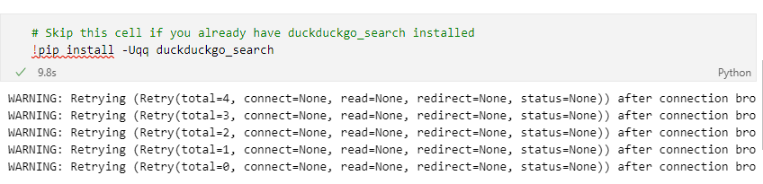
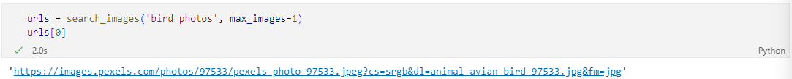
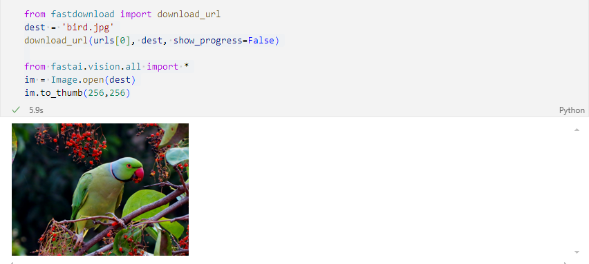
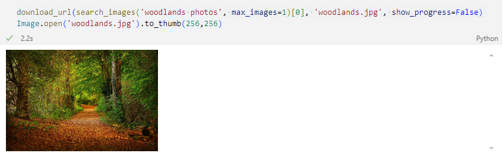

# Learning & Learning the bird & woodland model.

This blog is my learning about the example file `00-is-it-a-bird-creating-a-model-from-your-own-data.ipynb`, then I would explain my learning about this model from the perspective of code.

## Check the Internet connection

```python
import socket, warnings
try:
    socket.setdefaulttimeout(1)
    socket.socket(socket.AFINET, socket.SOCK_DGRAM.connect(('1.1.1.1', 53))
except socket.error as ex: raise Exception("STOP: No internet. Click '>|' in top right and set 'Internet' switch to on")
```

This step is to check if the device can connect to the Internet. In this file, it requires us to download the images from internet and then use the downloaded images to train this model. So, check internet connection is important, the result of not connecting, we will see the Figure 1 after we run the later codes.



Figure 1: The code runing without Internet.

## Check the environment

Here is the Python code:

```python
import os
iskaggle = os.environ.get('KAGGLE_KERNEL_RUN_TYPE', '')

if iskaggle:
    !pip install -Uqq fastai
```

This step is checking if the code is running under the Kaggle environment, if it is, the code will intall the latest fastai library automatically, the parameter `-U` means intall the latest version. If the fastai is not the latest version, this code will also update the fastai to the latest version as well.

## Download images from internet by using `duckduckgo_search`

### Install the `duckduckgo_serach` library

```python
!pip install -Uqq duckduckgo_search
```
This code can install the `duckduckgo_search` library if this library was not installed in the larptop, if your computer already has this library, skip this line of code.

### Define the searching function

```python
from duckduckgo_search import DDGS
from fastcore.all import *

ddgs = DDGS()

def search_images(term, max_images=200):
    return L(ddgs.images(term, max_results=max_images)).itemgot('image')
```

This code is defining the function that used to search the images for model training. It will return an array that contains the URLs of the images, we can set the number of images he searches for according to our needs, and if we do not give a specific number of images, this function will search 200 images in default.

Here is the example of using this function and we asked this function to search 1 image.

```python
urls = search_images('bird photos', max_images=1)
urls[0]
```
The Figure 2 shows the result of this code performed in my laptop.



Figure 2: The result of running function `search_images`.

According to Figure 2, we find that result is an url of image, we can not read any information for this link, then we need to show this image, it will use the following code.

```python
from fastdownload import download_url
dest = 'bird.jpg'
download_url(urls[0], dest, show_progress=False)

from fastai.vision.all import *
im = Image.open(dest)
im.to_thumb(256,256)
```

Then the result of running these code is shown in Figure 3.



Figure 3: The downloaded image of `search_image` example.

In this part of code, we imported a function named `download_url` from the `fastdownload` library. This Function can download the images according to the urls to our own folders, the second parameter `dest` is the filename of the downloaded image. If the image is in the same directory of the current code file, we can just use the filename we assigned for this image to open it, just like the sixth line of the Python code we just plotted.

Similarly, we can download the image of woodlands as well, the code is:

```python
download_url(search_images('woodlands photos', max_images=1)[0], 'woodlands.jpg', show_progress=False)
Image.open('woodlands.jpg').to_thumb(256,256)
```

And the result of running this code is shown in Figure 4.



Figure 4: Seach 1 image of woodland.

## Build the dataset for training.

Training set is necessary for Python training, in this file we are required to download the images by ourselves, so we need to use the function `search_images` to search images for training.


